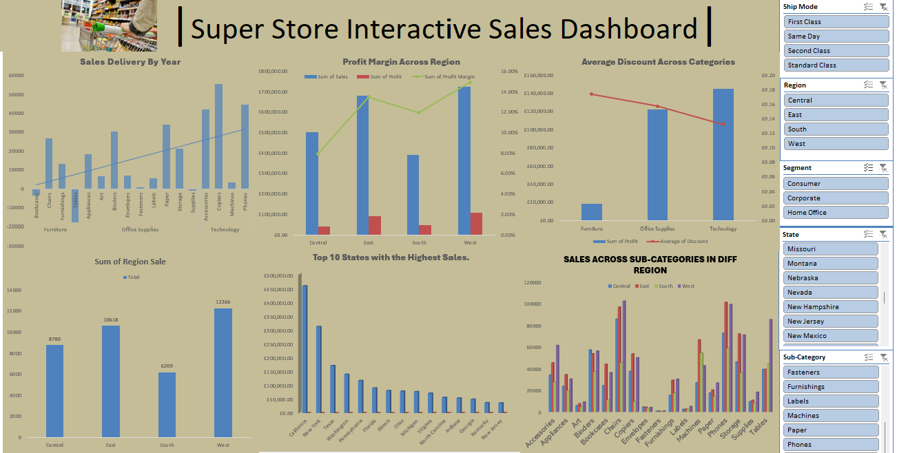
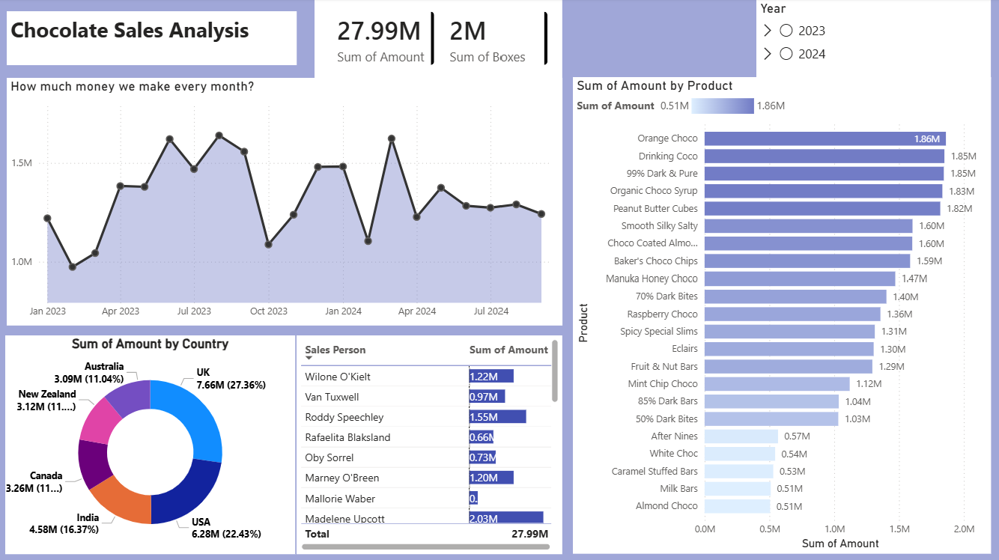

# Data Analytics Portfolio
## Project 1

**Title:**
[Chocolate Sales Analysis Dashboard](https://github.com/samlaw80/Samuel-Lawal/raw/refs/heads/main/second%20dash.pbix)

**Tools Used:**
 Power BI

**Project Description:**
This project involved analysing chocolate sales data to identify trends and patterns in product sales across countries from 2023-2024. It is designed to provide a comprehensive overview of key performance metrics. This dashboard allows stakeholders to easily identify best selling and underperforming products, compare revenue and volume by salesperson, track sales patterns over time and analyze sales distribution by country/region. The dashboard includes the following features:

Profit by Country and Chocolate: Visual representation of profits broken down by each country and type of chocolate.
Total Units Sold per Month: A monthly breakdown of the total units sold, providing insights into sales trends over time.
Profit by Month: Displays the monthly profit, allowing for easy comparison of profitability throughout the year.
Total Revenue by Country: Highlights the total revenue generated in each country, showcasing the performance in different markets.
Additionally, the dashboard includes interactive slicers and timeline for:
Month: Filter the data to view performance for a specific month or range of months.
Country: Focus on specific countries to analyze regional performance.
Product: Drill down into the performance of individual chocolate products.

**Key findings:**
This dashboard provides a high-level performance summary for a business, likely in the food or confectionery industry, covering sales data across 2023 and 2024.Here is an overview of the key insights:
1. Core FinancialsTotal Revenue: The "Sum of Amount" stands at 27.99M, generated from approximately 2M boxes sold. Monthly Trends: The line graph shows significant volatility. Revenue peaked in mid-2023 and early 2024, followed by a noticeable dip in late 2023 before rebounding.
2. Sales by Geography & PersonnelTop Markets: The UK is the leading region, contributing 27.36% (7.66M) of total sales. The USA follows closely at 22.43% (6.28M).Key Performers: Among the sales team, Roddy Speechley is the top contributor with 1.55M, followed by Wilone O'Kielt at 1.22M.
3. Product PerformanceThe bar chart highlights a diverse product range with relatively balanced sales across top items:Best Sellers: Orange Choco (1.86M) and Drinking Coco (1.85M) are the highest-grossing products.Middle Tier: Specialty items like "Organic Choco Syrup" and "Peanut Butter Cubes" also perform strongly, staying above the 1.8M mark.Lower Tier: Products like "Almond Choco" and "Milk Bars" are at the bottom of the portfolio, contributing around 0.5M each.
4. Regional Profitability: Identified the most profitable countries and highlighted regions where performance could be improved.
5. Seasonal Trends: Revealed patterns in sales and profit that correspond with seasonal events, allowing for more strategic planning.
6. Top-Performing Products: Highlighted which chocolate products are driving the most revenue and profit, aiding in inventory and marketing decisions.
7. Sales Volatility: Analyzed monthly sales fluctuations to understand market dynamics and adjust business strategies accordingly.
This dashboard serves as a crucial tool for the chocolate company’s management team, providing clear, actionable insights that drive informed decision-making and strategic planning.

**Dashboard Overview:**

## Project 2

**Title:**
[Sample sales Dashboard](https://github.com/samlaw80/Samuel-Lawal/blob/main/Dashboard%20sample_-_superstore.xlsx)

**Tools Used:**
 Excel

**Project Description:**

**Dashboard Overview:**

## Project 3

**Title:**
Football Players

**Sql Skills Used**

Data Retrieval (SELECT): Queried and extracted specific information from the database.

Data Aggregation (SUM, COUNT): Calculated totals, such as sales and quantities, and counted records to analyze data trends.

Data Filtering (WHERE, BETWEEN, IN, AND): Applied filters to select relevant data, including filtering by ranges and lists.

Data Source Specification (FROM): Specified the tables used as data sources for retrieval.

**Sql Code:**
 [football players ddl & dml](https://github.com/samlaw80/Samuel-Lawal/blob/main/footballplayers.sql)

**Project Description:**
